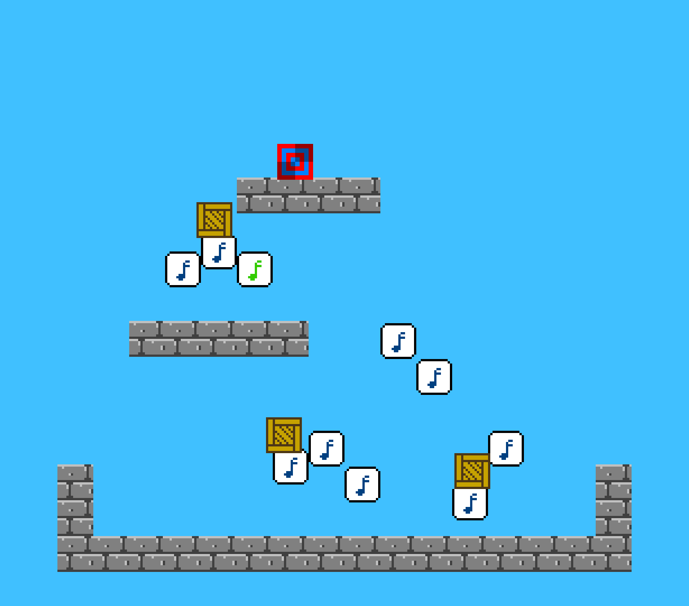

# Harmonic Balance

Author: George Ralph

Design: This platformer makes every level a music puzzle. Players solve the puzzle by fixing the out of tune notes.

Screen Shot:

How To Play:

Each level has a short tune being played on the note blocks, but a few of them are out of tune. Press R to hear the song, and see which blocks are out of tune (flash red). Push crates or stand on top of a note block to bring down 
its pitch.

Use A/D to move left or right, and W to jump. Push crates by walking into them.

Sources: 
Sprite pipeline and PPU code re-used from https://github.com/gdr22/15-466-f21-base1

Music is based on the works of Beethoven and Lemon Demon's album Dinosaurchestra,
which is published under an Attribution-NonCommercial-ShareAlike license.
https://lemondemon.bandcamp.com/album/dinosaurchestra
https://creativecommons.org/licenses/by-nc-sa/3.0/

This game was built with [NEST](NEST.md).

